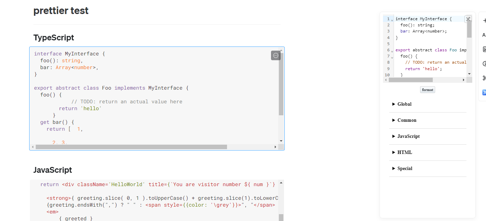
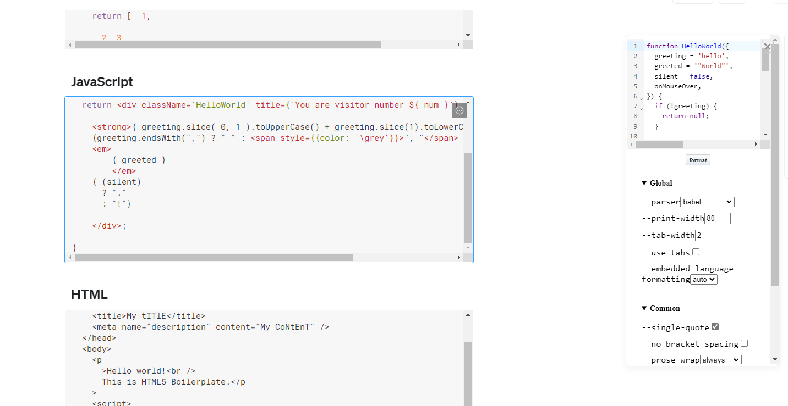
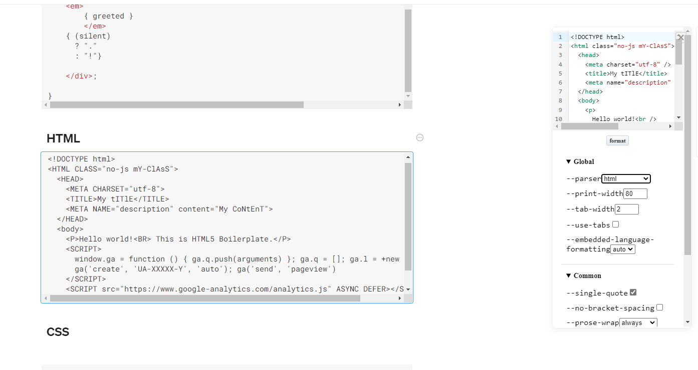
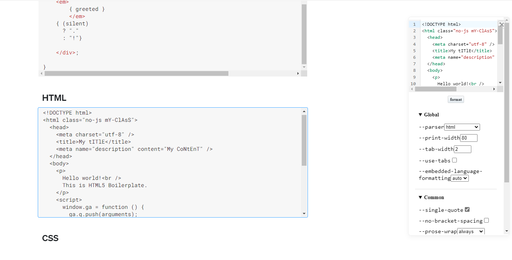

# Craft eXtension - Prettier
A [Craft](https://www.craft.do/) extension to format code blocks using [Prettier](https://prettier.io/)

## Features

### Preview
Preview the result on blocks clicking.

### Config
Options are the same with [Prettier Playground](https://prettier.io/playground/), so the formatting result can be
fine-tuned.

the parser is specified automatically based on the language of the selected block, but for those languages
[Craft](https://www.craft.do/) doesn't support it, it still can be specified manually.

### Format

Just click the `format` button, and the content of the block will be updated.

## Building

Simply run `npm install` and than `npm run build` to generate the .craftX file which can be installed.
You can use `npm run dev` to test and debug in your local environment

To learn more about Craft eXtensions visit the [Craft X developer portal](https://developer.craft.do).

## Links
[Prettier](https://prettier.io/)
[Prettier Playground](https://prettier.io/playground/)
